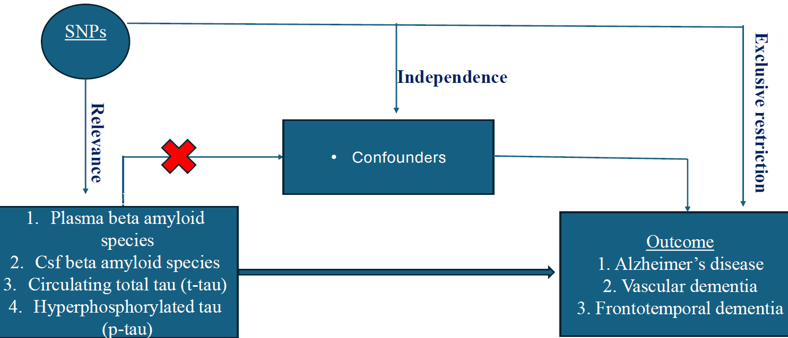
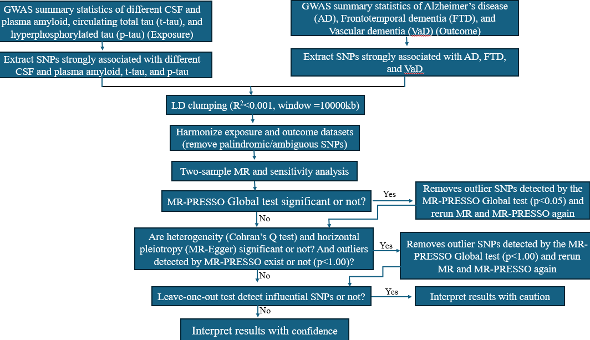

### Causal inference analysis of the effect of beta-amyloid and tau proteins on dementia risk: Mendelian randomization analysis
Jacob Apibilla Ayembilla1, Rachael Osemudiamen Osagie2, Adeyemi Timothy Akinade3, Oumar Sako4, Oluwafunmbi Ebenezer Ogunmiluyi5, Olaitan I. Awe6,7
1. Department of Science Laboratory Technology, Faculty of Applied Science, Accra Technical University, Box GP561, Barnes Road, Accra.
2. Faculty of Dental Medicine and Oral Health Sciences, McGill University, Montreal, QC, Canada.
3. Department of Genetics and Biochemistry, Clemson University, South Carolina, US
4. African Centre of Excellence in Bioinformatics and Data Intensive Science (ACE-B), USTTB, Bamako, Mali
5. Department of Physiology, University of Medical Sciences, Ondo, Ondo State, Nigeria
6. Department of Computer Science, University of Ibadan, Ibadan, Oyo, Nigeria
7. African Society for Bioinformatics and Computational Biology, Cape Town, South Africa

#### Project Overview
The global burden of dementia is escalating due to the ageing population. The key pathological hallmarks of Alzheimer's disease (AD) are amyloid plaques and hyperphosphorylated tau (p-tau) deposition and tangling in the brian which are critical risk factors for dementia. While amyloid and tau biomarkers are central to AD pathology, their causal roles across dementia subtypes are not fully understood.

#### Aim
The aim of the study was to examine the causal effect of CSF and plasma Aβ, circulating total tau (t-tau) and hyperphosphorylated tau (p-tau) proteins on dementia risk among individuals of European Ancestry.

#### Study Design
This study employed a causal inference analysis using Mendelian Randomization (MR) approach to examine the causal role of CSF and plasma Aβ, t-tau and p-tau proteins on dementia risk among individuals of European Ancestry. The study sourced publicly available genome wide association studies (GWAS) summary statistics from the GWAS catalog, OpenGWAS catalog and the FINNGEN databases for this analysis. Figure 1 is a schematic representation of the MR approach. The genetic instruments selected for the analysis were relevanto to the exposures, independent of confounders and exclusively were assoicated with the outcomes. 
<!--
 
-->

**Fig 1: Schematic representation of the causal effect of CSF and plasma amyloid, tau, and hyperphosphorylated tau proteins on dementia risk in European ancestry.**

#### Data Sources
The datasets fo this analysis were publicly available GWAS summary statistics from the GWAS catalog, OpenGWAS and the FINNGEN databases. The data included various CSF and Plasma amyloid, t-tau and p-tau which served as the exposure datasets and AD, FTD and VaD datasets which served as the outcome datasets. The details of the datasets are as presented in the Table 1 below.

**Table 1: GWAS summary statistics of CSF and plasma amyloid, t-tau, p-tau, AD, VaD and FTD analyzed**      
| Exposure GWAS summary statistics                                      | Outcome GWAS summary statistics |
| --------------------------------------------------------------------- | ------------------------------- |
| Plasma amyloid beta (Aβ1-40)                                          | Alzheimer's disease (AD)        |
| Plasma amyloid beta (Aβ1-42)                                          | Vascular dementia (VaD)         |
| Plasma amyloid beta (Aβ1-40/1-42)                                     | Frontotemporal dementia (FTD)   |
| Serum amyloid p-component (SAP)                                       |                                 
| Total circulating tau                                                 |                                 
| Cerebrospinal fluid amyloid beta 42 levels                            |                                 
| Cerebrospinal fluid amyloid beta 42 levels in abnormal amyloid levels |                                 
| Cerebrospinal fluid amyloid beta 42 levels in APOE e4 non-carriers    |                                 
| Cerebrospinal fluid amyloid beta 42 levels in APOE e4 carriers        |                                 
| Cerebrospinal fluid amyloid beta 42 levels in normal amyloid levels   |
| Cerebrospinal fluid p-tau levels in abnormal amyloid levels           |
| Cerebrospinal fluid p-tau levels                                      |
| Cerebrospinal fluid p-tau levels in APOE e4 non-carriers              |
| Cerebrospinal fluid p-tau levels in APOE e4 carriers                  | 
| Cerebrospinal fluid p-tau levels in normal amyloid levels             |

#### Mendelian Randomization workflow
In this study we followed the MR workflow illustrate to analysis the data
<!--

-->

**Fig 2: Mendelian Randomization analysis workflow for the causal effect of CSF and plasma amyloid, t-tau, and p-tau on dementia risk in European Ancestry**

#### Conclusion
The findings support the causal roles of tau and amyloid protein species in dementia risk, highlighting distinct pathways across subtypes. The study underscores the potential of biomarker-driven strategies for dementia prevention and therapeutic development.
